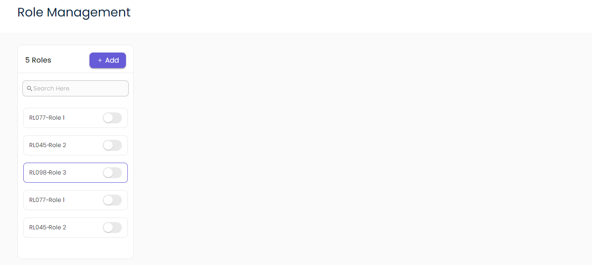

   
   # Readme

   # Image of the tree view component =  
   
   # Component 

   <RoleManagement
        roles={[
          {
            roleNo= 'RL077',
            role= 'Role 1',
            isActive= false,
          },
          {
            roleNo='RL045',
            role= 'Role 2',
            isActive= false,
          },
          {
            roleNo= 'RL084',
            role= 'Role 3',
            isActive= false,
          },
        ]}
        rolesGrid={
          breakpoints= {
            xs= 12,
            sm= 4.5,
            md= 3.5,
            lg= 2.5
          }
        }
        rolesView={
          breakpoints={
            xs= 12,
            sm= 9.5,
            md= 8.5,
            lg=9.5
          }
        }
        inputStyle={
          type= ''
          helperText= ''
          placeholder= ''
          errorMessage= '',
          isReadOnly= false,
          isError= false,
          multiline= false,
          fullWidth= true,
          value= '',
          startAdornment={<SearchIcon sx={{ ml: 1, fontSize: '16px', color: '#818181' }} />}
          header= '',
          textFieldStyle= {},
          disabled= false,
          variant= '',
          onChange= {() => null},
          inputBackground= '',
          height= '',
          fontSize= '',
          padding='',
          margin= '',
          border= '',
          borderRadius= '',
          borderBottom= ''
        }
        switchStyle={
            width= '',
            height= '',
            color= '',
            backgroundColor= ''
            thumbWidth= '',
            thumbHeight= ''
        }
      />

this above component show all props that are extracted. Now let's see the props in detailed which are listed 
below: 

rootStyle: {},
    roles: [],
    rolesGrid: {
      breakpoints: {
      }
    },
    rolesView: {
      breakpoints: {
      }
    },
    roleTitleSx: {},
    subRootPropsSx: {},
    roleBoxSx: {},
    roleHeadBorderSx: {},
    titlePropsSx: {},
    addIconSx: {},
    roleCardSx: {},
    checkIconPropsSx: {},
    closeIconPropSx: {},
    roleUnselectedCardSx: {},
    roleNoProps: {},
    editIconProps: {},
    inputStyle: {
      type: '',
      helperText: '',
      placeholder: '',
      errorMessage: '',
      isReadOnly: false,
      isError: false,
      multiline: false,
      fullWidth: true,
      value: '',
      // endAdornment: any,
      // startAdornment: any;
      header: '',
      textFieldStyle: {},
      disabled: false,
      variant: '',
      onChange: () => null,
      inputBackground: '',
      height: '',
      fontSize: '',
      padding: '',
      margin: '',
      border: '',
      borderRadius: '',
      borderBottom: ''
    }

rootStyle : whole container styling props

roles: It gives the JSON array data of the roles

leftSec: grid item of the left role section which gives breakpoints as props

rightSec: grid item of the right role view section which gives breakpoints as props

heading:  heading of the entire box

roles: array of the roles data

rolesGrid: left roles grid item breakpoint props

rolesView: right roles View grid item breakpoint props

roleTitleSx: role Management title props

subRootPropsSx: background color of the whole grid container

roleBoxSx: left role box styling props
    
roleHeadBorderSx: role heading border item props

titlePropsSx: role title props

addIconSx: add icon styling props

roleCardSx: role card props

checkIconPropsSx: check icon styling props
  
closeIconPropSx: close icon styling props

    roleUnselectedCardSx: {
      description: 'role card unselected state styling props'
    },
    roleNoProps: {
      description: 'role no styling props'
    },
    editIconProps: {
      description: 'edit Icon styling props'
    },
    inputStyle: {
      description: 'input styling as props'
    }

