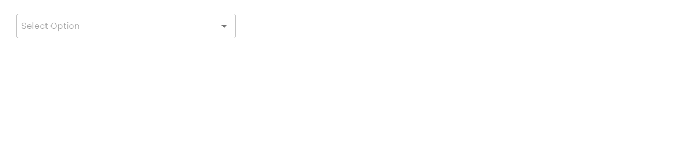

   
   # Readme

   # Image of the slect dropdown component =  
   
   # Component 
   <SelectBoxComponent
        limitTags={2}
        groupingProps={{
          isCloseIcon= true,
          isSearch= true,
          handleGroupChange= handleGroupChange,
          groupedData= groupedData,
          arrData= top100Films,
          defaultValue= [],
          label= ,
          dropdown= {
            minHeight= '',
            maxHeight= '',
            maxWidth= '',
            minWidth= '',
            backgroundColor= '',
            color= ''
          },
          input= {
            minHeight= '',
            minWidth= '',
            backgroundColor= '',
            maxWidth= '',
            maxHeight= '',
            color= '',
            border= '',
            borderRadius= ''
          }
        }}
        defaultProps={{
          isCloseIcon= true,
          isSearch= true,
          handleDefaultChange= handleDefaultChange,
          defaultData= defaultData,
          arrData= top100Films,
          defaultValue= [],
          label= '',
          dropdown= {
            minHeight= '',
            maxHeight= '',
            maxWidth= '',
            minWidth= '',
            backgroundColor= '',
            color= ''
          },
          input= {
            minHeight= '',
            minWidth= '',
            backgroundColor= '',
            maxWidth= '',
            maxHeight= '',
            color= '',
            border= '',
            borderRadius= ''
          }
        }}
        chipProps={{
          isCloseIcon= true,
          isSearch= true,
          handleChipChange= handleChipChange,
          chipData= chipData,
          arrData= top100Films,
          defaultValue= [],
          label= '',
          dropdown= {
            minHeight= '',
            maxHeight= '',
            maxWidth= '',
            minWidth= '',
            backgroundColor= '',
            color= ''
          },
          input= {
            minHeight= '',
            minWidth= '',
            backgroundColor= '',
            maxWidth= '',
            maxHeight= '',
            color= '',
            border= '',
            borderRadius= ''
          }
        }}
        checkboxProps={{
          isCloseIcon= true,
          isSearch= true,
          defaultValue= [],
          handleCheckedItem= handleCheckedItem,
          CheckableData= checked,
          arrData= checkedArr,
          label= '',
          dropdown= {
            minHeight= '',
            maxHeight= '',
            maxWidth= '',
            minWidth= '',
            backgroundColor= '',
            color= ''
          },
          input= {
            minHeight= '',
            minWidth= '',
            backgroundColor= '',
            maxWidth= '',
            maxHeight= '',
            color= '',
            border= '',
            borderRadius= ''
          }
        }}
        multi={true}
        selectType={'chip'} multiple={false}      />

this above component show all props that are extracted. Now let's see the props in detailed which are listed 
below:

limitTags : limited tags will be shown when it is multiple
groupingProps={{
    isCloseIcon : close icon props when selected,
          isSearch= search icon props when for input,
          handleGroupChange= handle change fn for grouped dropdown,
          groupedData= state value of grouped dropdown,
          arrData= JSON array data of grouped dropdown,
          defaultValue= defaut option props,
          label= label for the dropdown as props,
          dropdown= {
            minHeight= minheight for the dropdown,
            maxHeight= maxheight for the dropdown,
            maxWidth= maxWidth for the dropdown,
            minWidth= minWidth for the dropdown,
            backgroundColor= backgroundColor for the dropdown,
            color=color for the dropdown
          },
          input= {
            minHeight= minheight for the input field,
            minWidth= minWidth for the input field,
            backgroundColor= backgroundColor for the input field,
            maxWidth= maxWidth for the input field,
            maxHeight= maxHeight for the input field,
            color= color for the input field,
            border=border for the input field,
            borderRadius= borderRadius for the input field
          }
        }}
 defaultProps=It contains all props for dropdown and inputfield for default dropdown
 chipProps=It contains all props for dropdown and inputfield for chip dropdown
 checkboxProps=It contains all props for dropdown and inputfield for checkbox dropdown
 multi=it delivers whether multiple or single select box
 selectType=default or chip or checkbox or grouping

