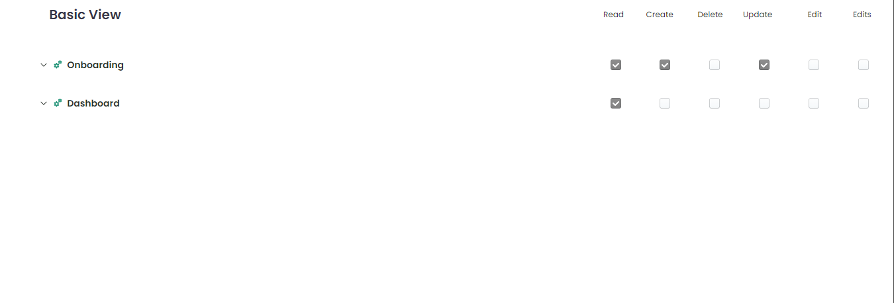

   
   # Readme

   # Image of the tree component =  
   
   # Component 
     <TreeComponent
        state={state}
        defaultExpandIcon={<ExpandIcon />}
        defaultCollapseIcon={<CollapseIcon />}
        checkboxsection={true}
        leftSec={{
          breakpoints: {
            xs: 4,
            sm: 4,
            md: 6,
            lg: 8
          }
        }}
        rightSec={{
          breakpoints: {
            xs: 8,
            sm: 8,
            md: 6,
            lg: 4
          }
        }}
        heading='Basic View'
        onChange={onChange}
        checkBoxStyles={{
          // checkboxIcon: '',
          // uncheckedIcon: '',
          checkboxBorderRadius: '8px',
          disable: false,
          isCheckBox: false,
          onChange: () => null
        }}
        permissionHeadingSx={undefined}
        setEdit={false}
        customLabel={{
          iconProp: {
            parent: <SettingIcon />,
            parentChild: <InfoIcon />
          },
          labelText: '',
          fontsize: '44px',
          isCheckBox: false,
          disable: false,
          onChange: () => null,
          index: '',
          formControlPropsSx: {},
          state: [],
        }} />

this above component show all props that are extracted. Now let's see the props in detailed which are listed 
below: 

state: 'state defines the data array JSON'

checkboxsection:  'hide or show checkbox section as props'

setEdit:  'disable state or edit state as props'

customLabel:  'icon items, fontsize, checkbox style items'

defaultCollapseIcon:  'collapsible icon as props'

defaultExpandIcon:  'expand icon as props'

checkBoxStyles:  'checked state and unchecked state, checkbox styling as props'

leftSec:  'left section grid item breakpoint props'

rightSec:  'right section grid item breakpoint props'

heading:  'heading as props'

permissionHeadingSx:  'permission stack element style as props'

