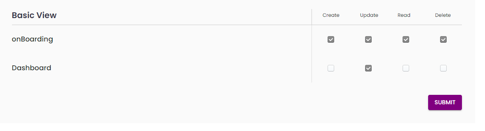

   
   # Readme

   # Image of the tree view component =  
   
   # Component 
    <TreeView
        handleChange={handleCheckBox}
        dataRow={rowArray}
        onSubmit={onSubmit}
        submitBtnText={'Submit'}
        submitBtnOptions={{
          variant: 'contained',
          bgColor: 'purple',
          textColor: '#ffff'
        }}
         checkboxBgColor={'red'}
        checkboxWidth={16}  
        checkboxHeight={16}
        heading='Basic View'
        leftSec={{
          breakpoints: {
            xs: 4,
            sm: 4,
            md: 6,
            lg: 8
          }
        }}
        rightSec={{
          breakpoints: {
            xs: 8,
            sm: 8,
            md: 6,
            lg: 4
          }
        }}
         checkboxIcon={undefined}
         uncheckedIcon={undefined}
        checkboxBorderRadius={''}
        checkboxBgColor={''}  
      />

this above component show all props that are extracted. Now let's see the props in detailed which are listed 
below: 

rootStyle: {},
    roles: [],
    rolesGrid: {
      breakpoints: {
      }
    },
    rolesView: {
      breakpoints: {
      }
    },
    roleTitleSx: {},
    subRootPropsSx: {},
    roleBoxSx: {},
    roleHeadBorderSx: {},
    titlePropsSx: {},
    addIconSx: {},
    roleCardSx: {},
    checkIconPropsSx: {},
    closeIconPropSx: {},
    roleUnselectedCardSx: {},
    roleNoProps: {},
    editIconProps: {},
    inputStyle: {
      type: '',
      helperText: '',
      placeholder: '',
      errorMessage: '',
      isReadOnly: false,
      isError: false,
      multiline: false,
      fullWidth: true,
      value: '',
      // endAdornment: any,
      // startAdornment: any;
      header: '',
      textFieldStyle: {},
      disabled: false,
      variant: '',
      onChange: () => null,
      inputBackground: '',
      height: '',
      fontSize: '',
      padding: '',
      margin: '',
      border: '',
      borderRadius: '',
      borderBottom: ''
    }

rootStyle : whole container styling props

roles: It gives the JSON array data of the roles

leftSec: grid item of the left role section which gives breakpoints as props

rightSec: grid item of the right role view section which gives breakpoints as props

heading:  heading of the entire box

roles: array of the roles data

rolesGrid: left roles grid item breakpoint props

rolesView: right roles View grid item breakpoint props

roleTitleSx: role Management title props

subRootPropsSx: background color of the whole grid container

roleBoxSx: left role box styling props
    
roleHeadBorderSx: role heading border item props

titlePropsSx: role title props

addIconSx: add icon styling props

roleCardSx: role card props

checkIconPropsSx: check icon styling props
  
closeIconPropSx: close icon styling props

    roleUnselectedCardSx: {
      description: 'role card unselected state styling props'
    },
    roleNoProps: {
      description: 'role no styling props'
    },
    editIconProps: {
      description: 'edit Icon styling props'
    },
    inputStyle: {
      description: 'input styling as props'
    }

